# NAS-survey
> A survey on Neural Architechture Search 

## list
* Neural Architecture Search with Reinforcement Learning (Zoph and Le. 2016; accepted at ICLR’17)  
https://arxiv.org/abs/1611.01578
* SMASH: One-Shot Model Architecture Search through HyperNetworks (Brock et al. 2017; accepted at NeurIPS workshop on Meta-Learning’17)  
https://arxiv.org/abs/1708.05344
* Learning Transferable Architectures for Scalable Image Recognition (Zoph et al. 2017; CVPR’18)  
https://arxiv.org/abs/1707.07012
* Progressive Neural Architecture Search (Liu et al. 2017; accepted at ECCV’18)  
https://arxiv.org/abs/1712.00559
* Understanding and Simplifying One-Shot Architecture Search (Bender et al. 2018; accepted at ICML’18)  
http://proceedings.mlr.press/v80/bender18a/bender18a.pdf
* Efficient Neural Architecture Search via Parameter Sharing (Pham et al. 2018; accepted at ICML’18)  
https://arxiv.org/abs/1802.03268
* DARTS: Differentiable Architecture Search (Liu et al. 2018; accepted at ICLR’19)  
https://arxiv.org/abs/1806.09055
* MnasNet: Platform-Aware Neural Architecture Search for Mobile (Tan et al. 2018; accepted at CVPR’19)  
https://arxiv.org/abs/1807.11626
* Path-Level Network Transformation for Efficient Architecture Search (Cai et al. 2018; accepted at ICML’18)  
https://arxiv.org/abs/1806.02639
* Neural Architecture Optimization (Luo et al. 2018; accepted at NeurIPS’18)  
https://arxiv.org/abs/1808.07233
* InstaNAS: Instance-aware Neural Architecture Search (Cheng et al. 2018)  
https://arxiv.org/abs/1811.10201
* Mixed Precision Quantization of ConvNets via Differentiable Neural Architecture Search (Wu et al. 2018)  
https://arxiv.org/abs/1812.00090
* ProxylessNAS: Direct Neural Architecture Search on Target Task and Hardware (Cai et al. 2018; accepted at ICLR’19)  
https://arxiv.org/abs/1812.00332
* FBNet: Hardware-Aware Efficient ConvNet Designvia Differentiable Neural Architecture Search (Wu et al. 2018; accepted at CVPR’19)   
https://arxiv.org/abs/1812.03443
* IRLAS: Inverse Reinforcement Learning for Architecture Search (Guo et al. 2018; accepted at CVPR’19)   
https://arxiv.org/abs/1812.05285
* SNAS: Stochastic Neural Architecture Search (Xie et al. 2018; accepted at ICLR’19)   
https://arxiv.org/abs/1812.09926
* Auto-DeepLab: Hierarchical Neural Architecture Search for Semantic Image Segmentation (Liu et al. 2019; accepted at CVPR’19)   
https://arxiv.org/abs/1901.02985
* Random Search and Reproducibility for Neural Architecture Search (Li and Talwalkar 2019)  
https://arxiv.org/abs/1902.07638
* Single Path One-Shot Neural Architecture Search with Uniform Sampling (Guo et al. 2019)  
https://arxiv.org/abs/1904.00420
* Single-Path NAS: Designing Hardware-Efficient ConvNets in less than 4 Hours (Stamoulis et al. 2019)  
https://arxiv.org/abs/1904.02877
* Progressive Differentiable Architecture Search: Bridging the Depth Gap between Search and Evaluation (Chen et al. 2019)  
https://arxiv.org/abs/1904.12760
* Searching for A Robust Neural Architecture in Four GPU Hours (Dong and Yang 2019, accepted at CVPR’19)  
https://github.com/D-X-Y/GDAS
* Adaptive Stochastic Natural Gradient Method for One-Shot Neural Architecture Search (Akimoto et al. 2019; accepted at ICML’19)  
https://arxiv.org/abs/1905.08537
* Transfer NAS: Knowledge Transfer between Search Spaces with Transformer Agents (Borsos et al. 2019)  
https://arxiv.org/abs/1906.08102
* FairNAS: Rethinking Evaluation Fairness of Weight Sharing Neural Architecture Search (Chu et al. 2019)  
https://arxiv.org/abs/1907.01845
* PC-DARTS: Partial Channel Connections for Memory-Efficient Differentiable Architecture Search (Xu et al. 2019)  
https://arxiv.org/abs/1907.05737
* SCARLET-NAS: Bridging the gap Between Scalability and Fairness in Neural Architecture Search (Chu et al. 2019)  
https://arxiv.org/abs/1908.06022
* DARTS+: Improved Differentiable Architecture Search with Early Stopping (Liang et al. 2019)  
https://arxiv.org/abs/1909.06035

## Gradient-based
- [DARTS: DIFFERENTIABLE ARCHITECTURE SEARCH](https://arxiv.org/pdf/1806.09055.pdf)
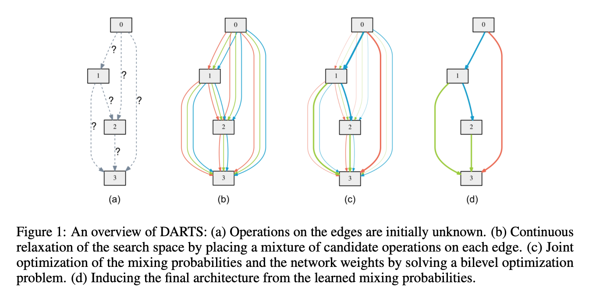

bilevel optimization problem

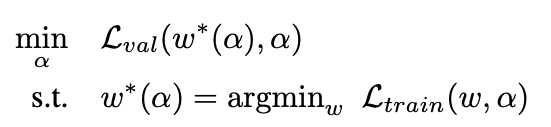

approximate  by adapting w using only a single training step, without solving the inner optimization

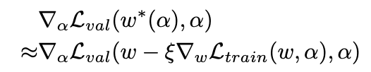

chain rule

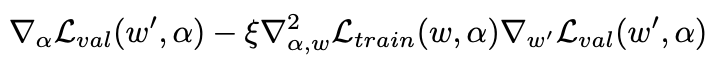

finite difference approximation

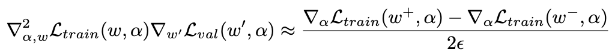

Evaluating the finite difference requires only two forward passes for the weights and two backward passes for α, and the complexity is reduced from O(|α||w|) to O(|α| + |w|).

- [Progressive Differentiable Architecture Search: Bridging the Depth Gap between Search and Evaluation](https://arxiv.org/pdf/1904.12760.pdf)
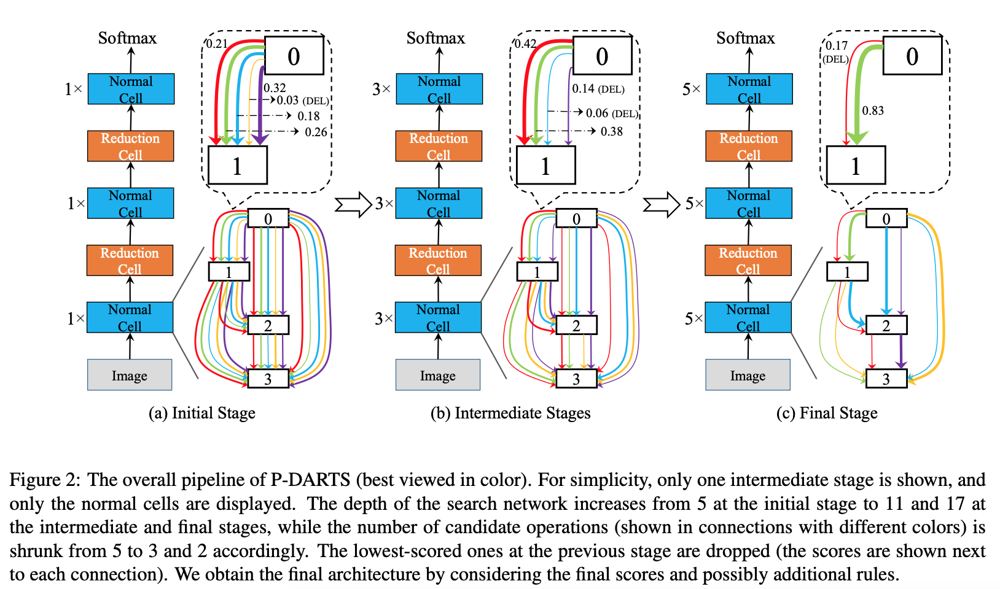

- [PC-DARTS: Partial Channel Connections for Memory-Efficient Differentiable Architecture Search](https://arxiv.org/pdf/1907.05737.pdf)
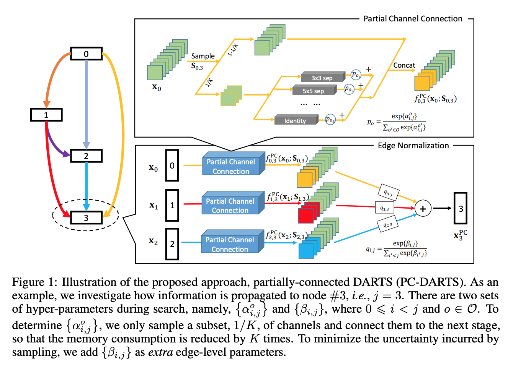

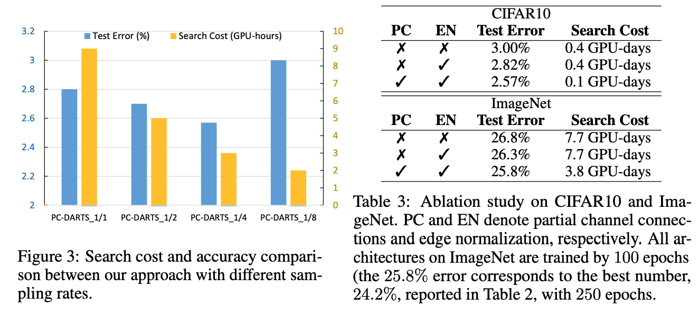

- [SNAS: STOCHASTIC NEURAL ARCHITECTURE SEARCH](https://openreview.net/pdf?id=rylqooRqK7)
- [DARTS+: Improved Differentiable Architecture Search with Early Stopping](https://arxiv.org/pdf/1909.06035.pdf)
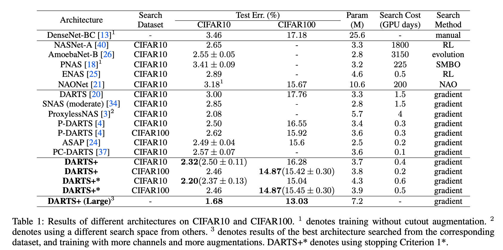

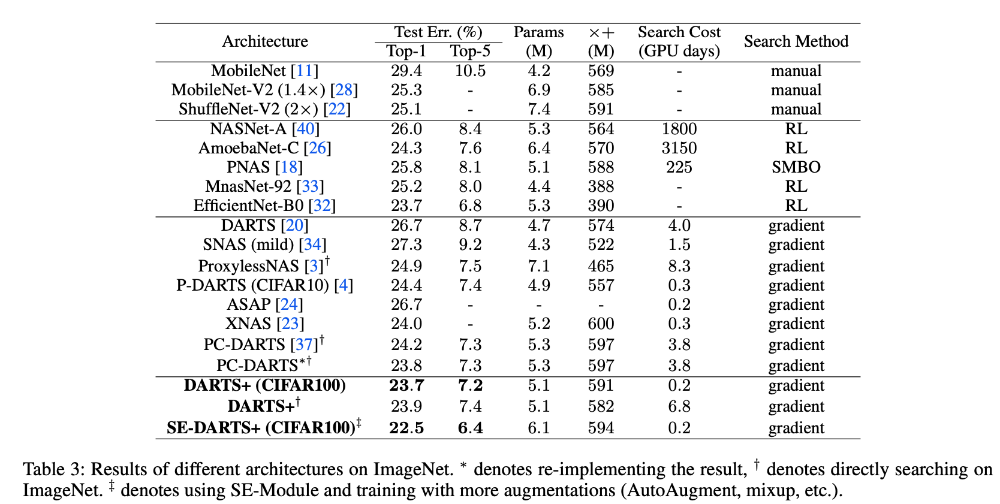
## Others

- [PROXYLESSNAS: DIRECT NEURAL ARCHITECTURE SEARCH ON TARGET TASK AND HARDWARE](https://arxiv.org/pdf/1812.00332.pdf)
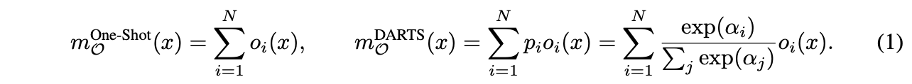

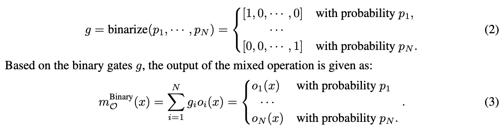

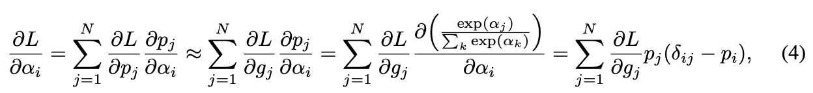

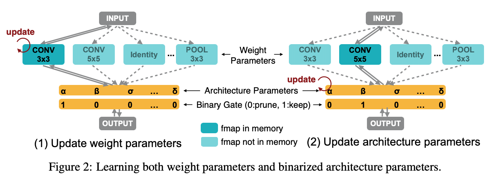

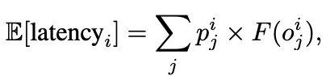

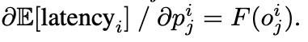

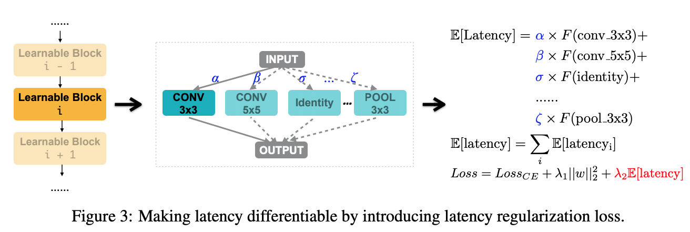

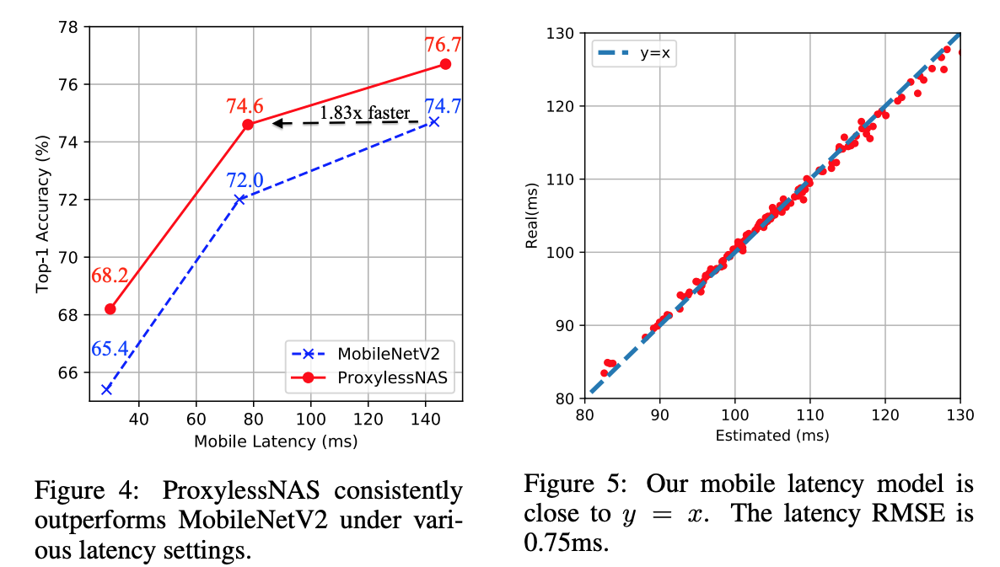
- [FairNAS: Rethinking Evaluation Fairness of Weight Sharing Neural Architecture Search ](https://arxiv.org/pdf/1907.01845.pdf)
- [MANAS: Multi-Agent Neural Architecture Search](https://arxiv.org/pdf/1909.01051.pdf)
- [Network Pruning via Transformable Architecture Search](https://arxiv.org/pdf/1905.09717.pdf)
- [Understanding and Simplifying One-Shot Architecture Search](http://proceedings.mlr.press/v80/bender18a/bender18a.pdf)

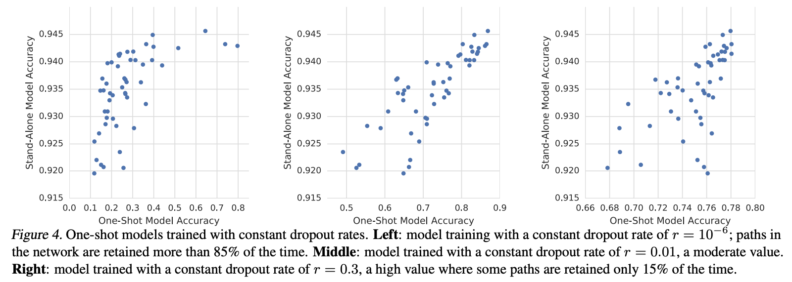

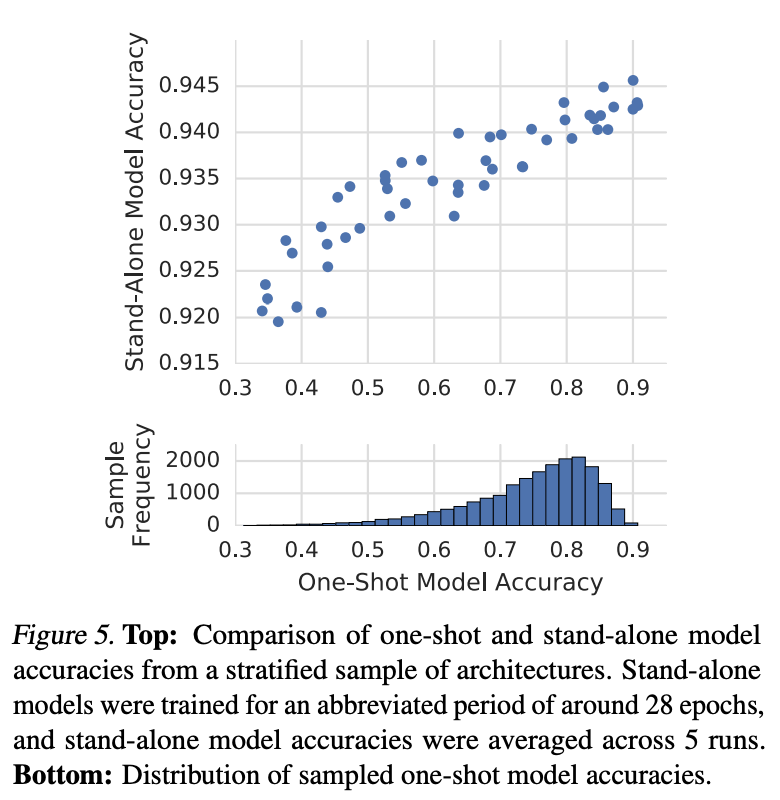

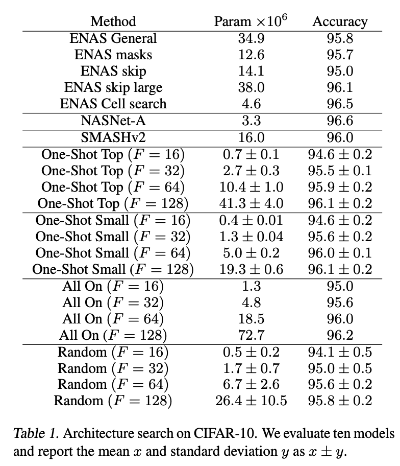

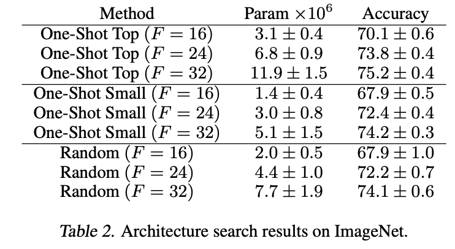

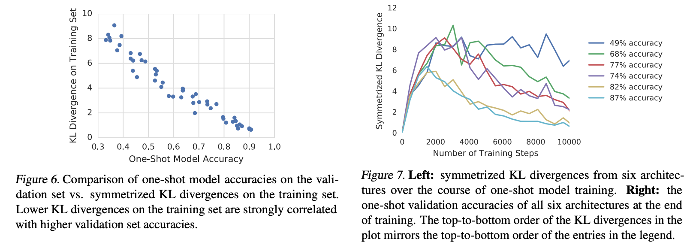

#### New image
1. `Cmd+Ctrl+Shift+4`
2. `Cmd+Alt+V`

#### Preview
`Cmd+K V`
